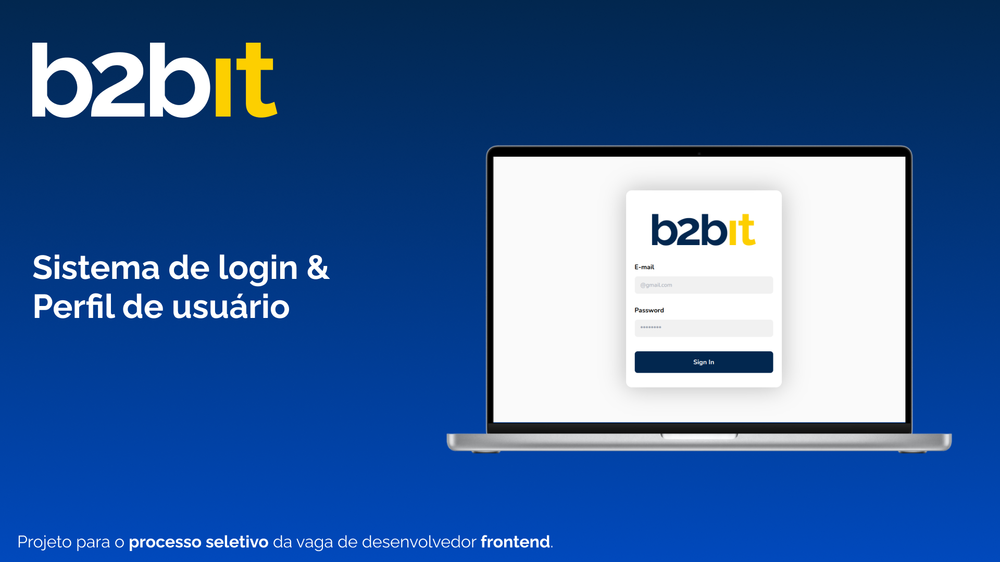
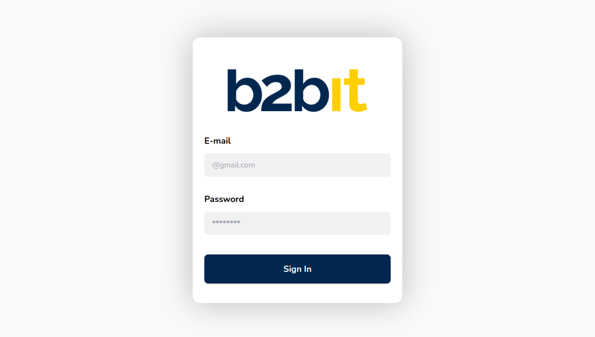
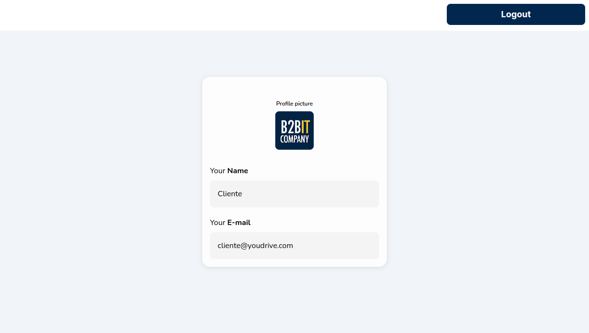
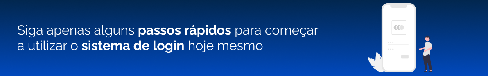

<div align="center">


</div>

## Sobre o Projeto 📝

Este projeto foi feito para o processo seletivo da empresa B2bit, onde foi proposto o desafio de um sistema de login consumindo uma API e exibindo as informações do usuário na tela.

O projeto conta com duas páginas: a página de login, onde o usuário pode inserir seu e-mail e senha para acessar a aplicação, e a página de perfil, onde são exibidas as informações do usuário autenticado.

Além disso, o projeto conta com testes unitários para garantir a qualidade do código e também design responsivo, para que a aplicação possa ser acessada em diferentes dispositivos.

## Layout 🎨

O layout da aplicação foi desenvolvido com base no protótipo fornecido pela empresa B2bit, e pode ser acessado através [deste link](https://www.figma.com/proto/klaZDgYO9WDU2z1LHeC3Dr/Projeto-Frontend?node-id=2-130&scaling=min-zoom&page-id=0%3A1&starting-point-node-id=2%3A130).

<p align="center">
    
    
</p>

## Funcionalidades 🌟

- [x] Login de usuário
- [x] Exibição de informações do usuário
- [x] Logout de usuário
- [x] Testes unitários
- [] Feedback de erro no login

## Tecnologias utilizadas ⚒️

As seguintes ferramentas foram usadas na construção do projeto:

- [Create React App](https://github.com/facebook/create-react-app)
- [React](https://reactjs.org/)
- [TypeScript](https://www.typescriptlang.org/)
- [Tailwind CSS](https://tailwindcss.com/)
- [Jest](https://jestjs.io/pt-BR/)
- [React Testing Library](https://testing-library.com/)
- [Axios](https://axios-http.com/docs/intro)
- [React Router](https://reactrouter.com/en/main)
- [Vercel](https://vercel.com/)



## Instruções de uso 📋

Se desejar acessar a aplicação através do seu navegador, basta clicar [aqui](https://projeto-b2bit-dlmn.vercel.app/).

1. Para acessar a aplicação, insira o e-mail `cliente@youdrive.com` e a senha `password`.
2. Clique no botão "Sign In" para acessar a página de perfil.
3. Na página de perfil, você poderá visualizar as informações do usuário autenticado. Como foto de perfil, nome, e e-mail.
4. Para sair da aplicação, clique no botão "Logout".

## Rotas da aplicação 📍 

A aplicação possui as seguintes rotas:

| Rota               | Descrição                                          
|----------------------|-----------------------------------------------------
| <kbd>/</kbd>     | Página inicial de login
| <kbd>/profile</kbd>     | Página de perfil do usuário (Somente usuários autenticados)

## Instruções de instalação 🚀

Para rodar a aplicação em sua máquina, siga os passos abaixo:

```bash
# Clone este repositório para sua máquina usando HTTPS
git clone https://github.com/Fransuelton/projeto-b2bit.git

# Ou, se preferir, clone usando SSH
git clone git@github.com:Fransuelton/projeto-b2bit.git

# Navegue até a pasta do projeto no seu terminal ou prompt de comando
cd projeto-b2bit

# Instale todas as dependências necessárias
npm install

# Agora, vamos iniciar a aplicação em modo de desenvolvimento
npm start

# E pronto! basta acessar http://localhost:3000 no seu navegador favorito.
```

## Testes 🧪

Os testes foram feitos utilizando a biblioteca Jest e React Testing Library, e garantem a qualidade do código da aplicação. Para rodar os testes unitários, basta executar o seguinte comando:

```bash
npm test
```

## Autor 👨‍💻


